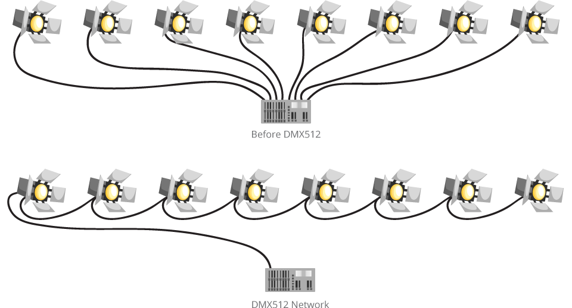

# Présentation DMX

## Qu'est-ce le Digital Multiplex ?
Le DMX est un protocole utilisé pour contrôler des appareils tels que les jeux de lumière ou les machines à fumée. Plus simplement, le DMX est un protocole pour les lumières créer en 1986.

## Pourquoi le DMX à été inventé ?
Avant 1986, par exemples dans les théâtres, chaque fonctions nécessitaient un câble individuel entre le contrôleur et l'appareil. Cela devenait beaucoup trop massif et couteuse à transporter de théâtre à théâtre. À l'invention du DMX il ne fallait qu'un cable pour que tout fonctionne, ils relliaient un cable de la console et les appareils. Le DMX permet de controler jusqu'à 512 canaux. Chaque appareil DMX possède une entrée et une sortie, ce qui vous permet de connecter en chaîne votre câble DMX d'un jeu de lumière à l'autre, il est extrêmement stable et éficace et ces pour cela qu'il n'a pas changé depuis sa création.

## Tutoriel DMX
 Pour relier vos éclairages à votre console DMX, rien de plus simple ! Il vous suffit de chainer vos éclairages en série en partant de votre console.  
 Ex : 
1. Pour que le contrôleur DMX puisse contrôler chaque produit DMX, l'utilisateur doit d'abord configurer les caractéristiques de chaque produit afin de déterminer le nombre de canaux requis pour contrôler l'appareil. Une adresse DMX sera attribuée à chaque canal.
2. Une fois cette affectation terminée, et en fonction du nombre de canaux utilisés, le produit répondra aux signaux DMX envoyés à la gamme de canaux DMX qui commence par l'adresse de départ.

